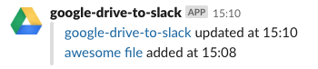

# gas-google-drive-to-slack

> Post Google Drive file changes to Slack on Google Apps Script

## Requirements

- Slack incoming webhook

## Installation

1. Upload [dist/bundle.js](./dist/bundle.js) and [dist/index.js](./dist/index.js).  
   Or if you're using [@google/clasp](https://github.com/google/clasp), edit `scriptId` property in `.clasp.json` and run `npm run deploy`.
1. Set `slackWebhookUrl` property in script properties (**File > Project Properties > Script Properties**).
1. Create a Time-driven trigger to run `main` function periodically (e.g. every hour).

## License

MIT
